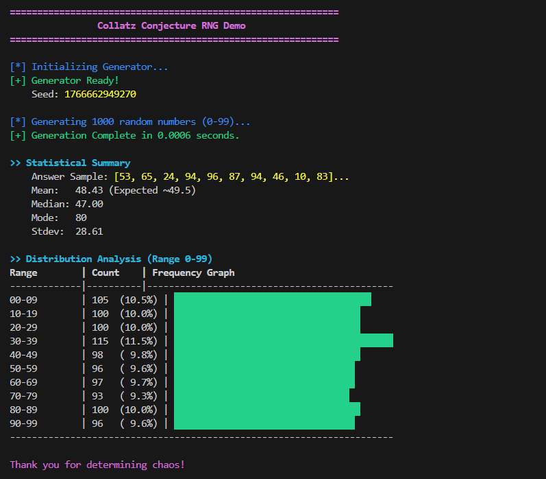

# 🎲 Collatz Random Number Generator

<div align="center">


**A conceptual pseudo-random number generator (PRNG) harvesting entropy from the chaotic orbits of the mathematical 3n+1 problem.**

[Theory](#-theory) • [Installation](#-installation) • [Usage](#-usage) • [API](#-api-reference) • [Disclaimer](#-disclaimer)

</div>

---

## 🧐 Theory: The Chaos of $3n+1$

The **Collatz Conjecture** (also known as the Ulam conjecture, Kakutani's problem, or the Hailstone sequence) is a mathematical problem that concerns a sequence defined as follows:

Start with any positive integer $n$. Then each term is obtained from the previous term as follows:
$$ f(n) = \begin{cases} n/2 & \text{if } n \equiv 0 \pmod{2} \\ 3n+1 & \text{if } n \equiv 1 \pmod{2} \end{cases} $$

### The "Hailstone" Effect
The sequence of numbers generated by this process is often referred to as "hailstone numbers" because the values typically ascend and descend multiple times, like hailstones in a cloud, before eventually falling to 1.

**Why use it for RNG?**
While the Collatz map is deterministic, the trajectory (path) a number takes to reach 1 is highly unpredictable and exhibits chaotic behavior. We utilize the **Least Significant Bits (LSB)** of the path values and the path length to generate pseudo-randomness.

---

## ⚙️ How It Works (Internal Mechanics)

1.  **State Initialization:** The generator is seeded with an integer (defaulting to the current system time).
2.  **Trajectory Step:** For each request, the internal state advances one step through the Collatz map ($n \to n/2$ or $n \to 3n+1$).
3.  **Entropy Extraction:**
    *   We extract simple bits based on parity ($n \pmod 2$).
    *   We combine high-order bits from the state to form larger integers.
4.  **Loop Avoidance (The "Kick"):**
    *   Problem: All Collatz sequences (conjecturally) end in the $4 \to 2 \to 1$ loop.
    *   Solution: When the state reaches `1`, our generator detects this collapse and applies a **Linear Congruential Generator (LCG)** step (a "kick") to jump to a new, random starting point deep in the number field, restarting the chaotic orbit.

---

## 💻 Installation

Clone the repository to your local machine:

```bash
git clone https://github.com/Yigtwxx/bsg-random-number-generator.git
cd bsg-random-number-generator
```

No external dependencies are required for the core RNG (`collatz_rng.py`). Standard library only!

---

## 🚀 Usage

### Running the Visual Demo
We've included a rich terminal-based demo to visualize the output distribution.

```bash
python demo.py
```



*Produces a colorful histogram and statistical summary in your terminal.*

### Integrating in Python Code

```python
from collatz_rng import CollatzRNG

# 1. Initialize
# Seeds automatically using current time
rng = CollatzRNG()

# Optional: Deterministic seeding for reproducible results
# rng = CollatzRNG(seed=123456)

# 2. Generate Random Numbers
print("Random Integer (0-100):", rng.randint(0, 100))
print("Random Float (0.0-1.0):", rng.random())

# 3. Generate a list
random_list = [rng.randint(1, 10) for _ in range(5)]
print("Dice Rolls:", random_list)
```

---

## 📚 API Reference

### `class CollatzRNG(seed=None)`

*   **`__init__(seed=None)`**: Initializes the generator. If `seed` is `None`, uses `int(time.time() * 1000)`.
*   **`seed(n)`**: Manually resets the state to integer `n`.
*   **`randint(low, high)`**: Returns a random integer `N` such that `low <= N <= high`.
*   **`random()`**: Returns a random floating point number in the range `[0.0, 1.0)`.

---

## ⚠️ Disclaimer

> [!IMPORTANT]
> **Not Cryptographically Secure:** This generator is intended for **educational and experimental purposes only**. It attempts to pass statistical randomness tests but has not been rigorously audited for cryptographic security. **Do not use this for generating passwords, private keys, or other sensitive security contexts.** Use Python's `secrets` module for those needs.

---

## 🤝 Contributing

Contributions are welcome! If you have ideas on how to extract more entropy from the Collatz orbits or improve the distribution uniformity:

1.  Fork the Project
2.  Create your Feature Branch (`git checkout -b feature/AmazingFeature`)
3.  Commit your Changes (`git commit -m 'Add some AmazingFeature'`)
4.  Push to the Branch (`git push origin feature/AmazingFeature`)
5.  Open a Pull Request

---

## 📬 Contact

<div align="center">

[](https://www.linkedin.com/in/yi%C4%9Fit-erdo%C4%9Fan-ba7a64294)
[](mailto:yigiterdogan023@gmail.com)
[](https://github.com/Yigtwxx)

**Yiğit Erdoğan**

**Made with ❤️ and Chaos**

</div>
